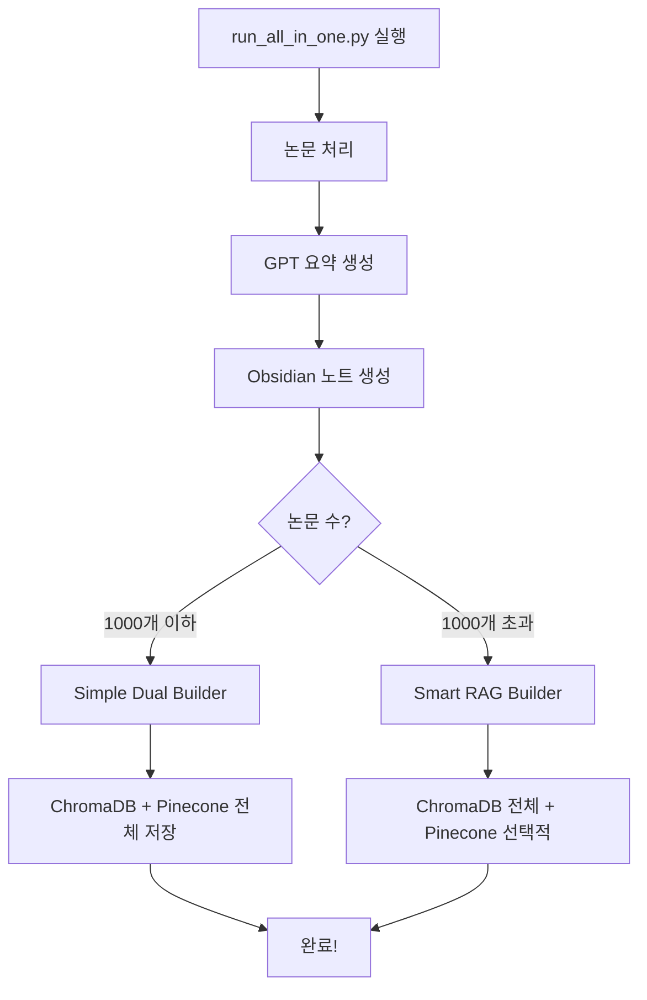

# 🤖 자동 RAG 설정 가이드

## 🎯 한 번에 모든 작업 실행

### 1. **All-in-One 실행** (새로운 방법!)
```bash
# 논문 처리 + RAG 구축 한 번에!
python scripts/run_all_in_one.py

# 특정 컬렉션만
python scripts/run_all_in_one.py --collection "LNP"

# 빠른 처리 (GPT 요약 없이)
python scripts/run_all_in_one.py --skip-gpt

# RAG만 구축
python scripts/run_all_in_one.py --rag-only
```

## 📋 실행 순서



## 🚀 사용 시나리오

### 시나리오 1: 처음 시작
```bash
# 1. 환경 설정
cp .env.example .env
# .env 파일 편집 (API 키 입력)

# 2. 패키지 설치
pip install -r requirements.txt
pip install -r requirements_rag.txt

# 3. 전체 자동 실행
python scripts/run_all_in_one.py
```

### 시나리오 2: 매일 업데이트
```bash
# 최근 논문만 처리 + RAG 업데이트
python scripts/run_all_in_one.py --collection "Recent" --limit 50
```

### 시나리오 3: 대량 처리
```bash
# 병렬 처리로 빠르게
python scripts/run_all_in_one.py --workers 10 --skip-gpt
```

## ⚙️ 자동화 설정

### 1. **Cron Job (Linux/Mac)**
```bash
# crontab -e
# 매일 오전 6시 실행
0 6 * * * cd /path/to/literature_batch_scripts && python scripts/run_all_in_one.py
```

### 2. **Task Scheduler (Windows)**
```powershell
# PowerShell 스크립트
cd C:\path\to\literature_batch_scripts
python scripts\run_all_in_one.py
```

### 3. **GitHub Actions**
```yaml
name: Daily Literature Update
on:
  schedule:
    - cron: '0 6 * * *'
jobs:
  update:
    runs-on: ubuntu-latest
    steps:
      - uses: actions/checkout@v2
      - name: Run all-in-one
        run: python scripts/run_all_in_one.py
```

## 📊 프로세스 모니터링

### 실시간 진행 상황
```
🚀 All-in-One Literature Processing
============================================================

📚 Step 1: 논문 처리 및 요약 생성
----------------------------------------
Processing papers: 100%|████████| 50/50
✅ 논문 처리 완료!

🔨 Step 2: RAG 시스템 구축
----------------------------------------
논문 수: 50개
→ Simple Dual Builder 사용 (전체 저장)
  Pinecone 예상 사용량: 12.5%
논문 처리 중: 100%|████████| 50/50
✅ RAG 구축 완료!

📊 최종 요약
============================================================
✅ Obsidian 노트: 50개
✅ Pinecone 벡터: 1,250개 (1.25%)
✅ ChromaDB: 활성

🎉 모든 작업 완료!
```

## 🔧 고급 설정

### 환경 변수로 자동화
```bash
# .env 파일
AUTO_RUN_RAG=true           # RAG 자동 실행
AUTO_RAG_THRESHOLD=1000     # 임계값
PREFER_SIMPLE_BUILDER=true  # Simple Builder 우선
```

### Python 스크립트에서 호출
```python
import subprocess

# 자동 실행
result = subprocess.run([
    'python', 'scripts/run_all_in_one.py',
    '--collection', 'Important Papers',
    '--workers', '8'
], capture_output=True)

if result.returncode == 0:
    print("✅ 성공!")
```

## 💡 최적화 팁

### 1. **소규모 (< 100 논문)**
```bash
# 고품질 모드
python scripts/run_all_in_one.py
```

### 2. **중규모 (100-1000 논문)**
```bash
# 균형 모드
python scripts/run_all_in_one.py --workers 5
```

### 3. **대규모 (> 1000 논문)**
```bash
# 빠른 처리 + 중요도 기반
python scripts/run_all_in_one.py --skip-gpt --workers 10
```

## 🎯 결론

이제 **한 번의 명령**으로:
1. ✅ Zotero에서 논문 가져오기
2. ✅ PDF 텍스트 추출
3. ✅ GPT/Gemini 요약 생성
4. ✅ Obsidian 노트 생성
5. ✅ ChromaDB 벡터화
6. ✅ Pinecone 업로드
7. ✅ RAG 시스템 준비

모든 것이 자동으로 처리됩니다!